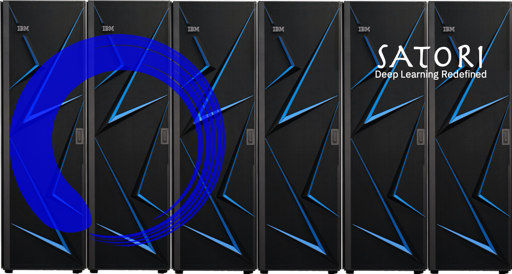

   Satori

SATORI: Getting Started Documentation for Early Access (EA)
-----------------------------------------------------------

This section provides a “lightning-quick” guide for early access of
Satori users such as:

-  How to optain your login credentials

-  How to `connect in the Satori <satori-ssh.rst>`__ cluster via
   SSH/SCP/HTTPS

-  `Installing
   Python <https://github.com/mit-satori/getting-started/blob/master/satori-ai-frameworks.rst>`__
   environment (Anaconda) on your login profile

-  `Installing
   WMLCE <https://github.com/mit-satori/getting-started/blob/master/satori-ai-frameworks.rst>`__
   optimized Machine Learning and Deep Learning libraries and frameworks
   on your login profile

-  Learn how you can start your training jobs.\ `Examples of training
   jobs
   submision <https://github.com/mit-satori/getting-started/blob/master/satori-workload-manager.rst>`__
   and management in the Satori cluster.

-  How to manage `distributed deep learning in TensorFlow and
   Pytorch <https://github.com/mit-satori/getting-started/blob/master/satori-distributed-deeplearning.rst>`__

-  Are you training large models that cannot be fit into GPU memory?
   Have a look how you can `enable Large Model Support
   (LMS) <https://github.com/mit-satori/getting-started/blob/master/satori-large-model-support.rst>`__
   in your TensorFLow or Pytorch python scripts.

-  Example of Snap Machine Learning
   `(SnapML/pai4sk) <https://github.com/IBM/powerai/tree/master/examples/SnapML>`__

-  `Additional
   trainings <https://github.com/mit-satori/getting-started/blob/master/satori-training.rst>`__
   (video format) for CUDA UNIFIED MEMORY, GPUDirect, LSF Workload
   Manager, POWER9 SMT4 etc
   
-  `Public Datasets for Machine Learning and Deep Learning <https://github.com/mit-satori/getting-started/blob/master/satori-public-datasets.rst>`__ on Satori that can be used day 1 in your deep learning projects. Will save your time and our Internet bandwith :)

-  `Troubleshooting <satori-troubleshooting.rst>`__

-  You don’t find what you where looking for? have a look to `conda
   cheet
   sheet <https://github.com/mit-satori/getting-started/blob/master/satori-conda-cheatsheet.pdf>`__
   and WMLCE extended documentation
   `here <https://www.ibm.com/support/knowledgecenter/SS5SF7_1.6.2/navigation/wmlce_getstarted.html>`__
   before asking for help.

-  Still need help ? Email satori-admin@techsquare.com 
