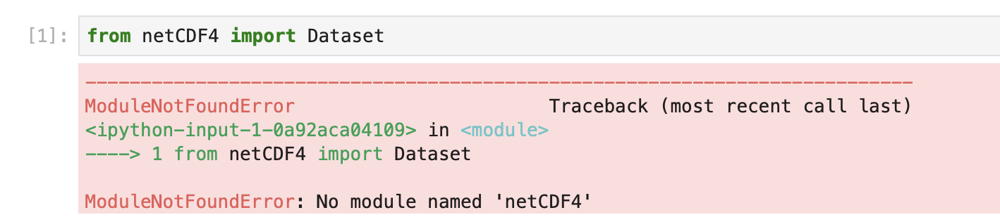
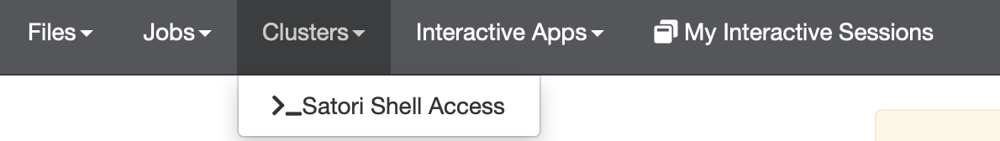

Creating your own Jupyter kernels for OOD portal
++++++++++++++++++++++++++++++++++++++++++++++++

The OOD portal has a set of centrally installed Jupyter kernels that
include common software. The software aims to cover most
things needed for frequently used tools. If you start using
the portal extensively, sometimes you will come across
packages that are missing and see a message like this image

When this happens it is possible to create a custom kernel yourself.
This kernel will then be included in the OOD menu for your account. That kernel can
include any available software you want. You can also request that the
module be added to one of the standard environments or that a new standard environment
be added. Sometimes, however, getting a module added to the standard environment 
requires waiting or the module may conflict with something else. 

By learning how to add your own kernels you can avoid having to wait and work around
any incompatibilities. You can also gather customized, versioned sets of tools into 
a standard kernels that can then be shared within a group working on a common 
project, or that you can request be added for your group to a standard set. This can
be more efficient than having to wait for something to installed centrally every
time you find a new awesome package that all the cool people are using. 

An additional benefit of knowing how to create your own kernels is that it can help with sharing and reproducibility
of results. Stric versioning and maintaining historic kernels in perpetuity in central locations 
can easily become an impractical combinatorial challenge. Creating
precise kernels that collect specific version combinations of software in an 
immutable state in a per account location can help, although this still requires care and
diligence!

Steps to create a kernel
========================

These instructions assume you are slightly familiar with conda ( https://docs.conda.io/en/latest/index.html ), that you are
starting a brand new conda environment for this kernel. The steps involve a series of terminal commands. There is a terminal
available in the OOD portal, under the **Clusters** pull-down.

