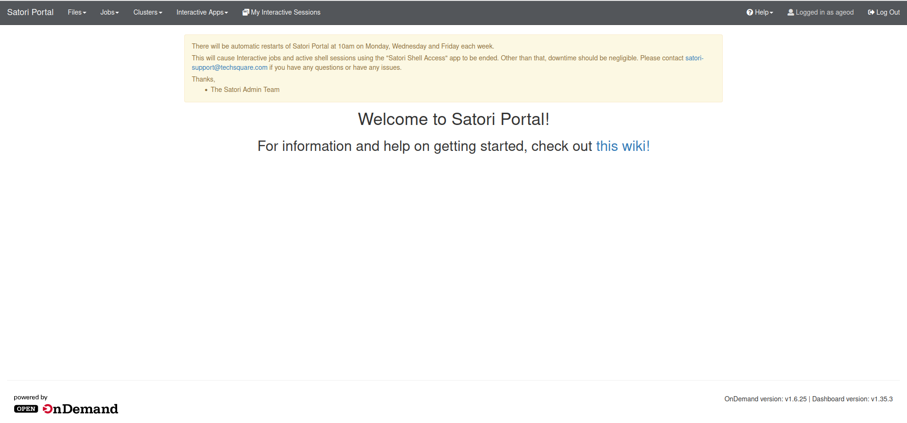
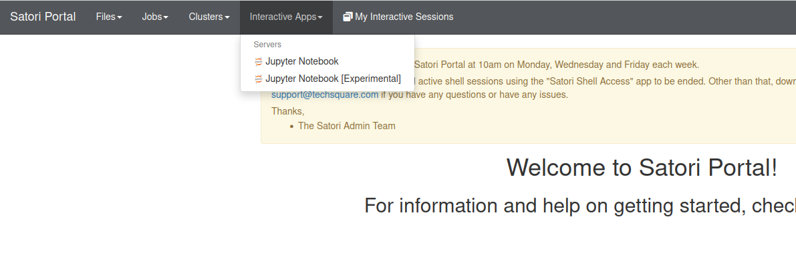
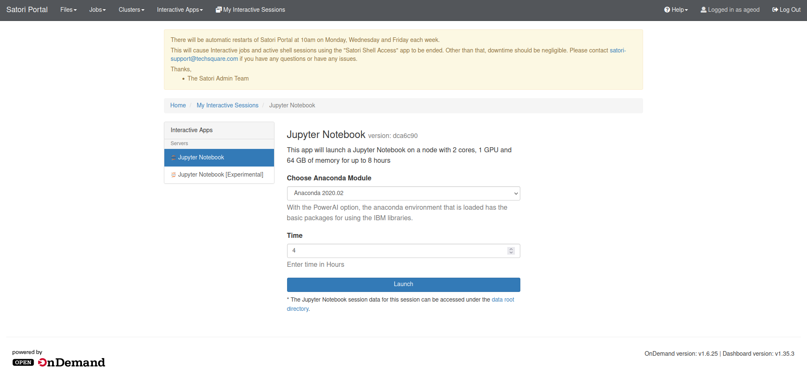
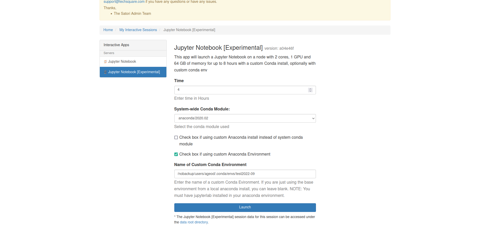
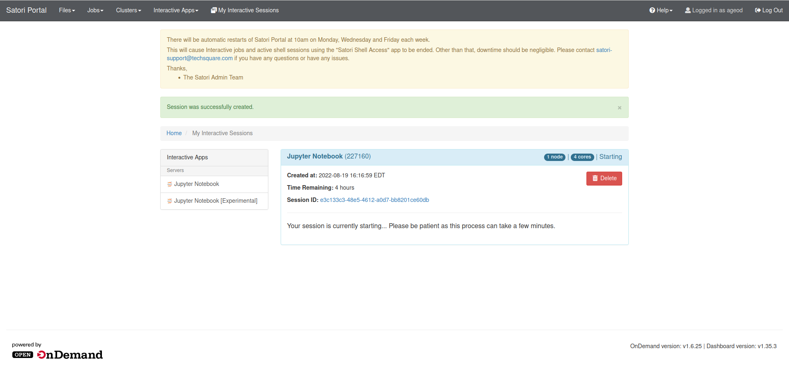
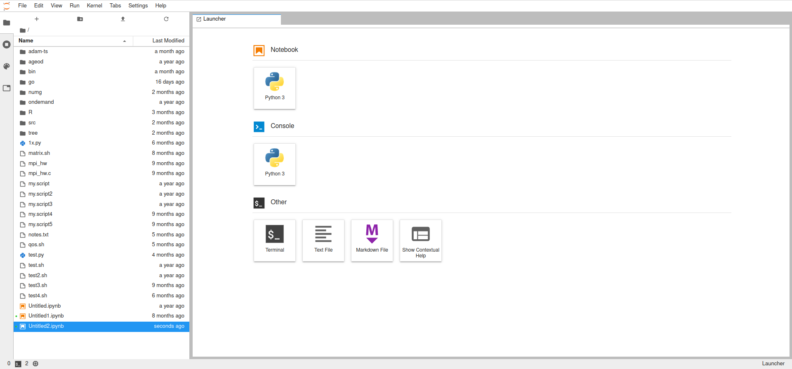

Satori Portal
=============

[1] Accessing the Portal
''''''''''''''''''''''''

The Satori Portal can be found here: https://satori-portal.mit.edu/

The portal is the first step in accessing the cluster. Satori is available to all MIT students and staff with an active Kerberos ID. If you have not logged in before, the portal will help you activate your account. To do that, visit the link above. Click the "Authenticate with Globus" button, and you'll be asked to select an organization. Select "Massachusetts Institute of Technology" and click "Continue". You'll be taken to your MIT Kerberos login page, where you should log in. Follow the prompts (you'll be asked if you want to associate with an existing Globus login, if you don't use Globus you can ignore this and press left button) and follow the instructions on the screen. Your account should be activated at this point.

Once authenticated, you will land here:

[2] Using the Portal
''''''''''''''''''''''''''''

There are a number of actions you can take using the header bar at the top of the screen.

1. Files

* Here you can access your /home directory and your /nobackup/users directory contents in a browser window. Files can be viewed and manipulated.
  
2. Jobs

* The "Jobs" tab will list any active jobs you may currently have running. There is also a "Job Composer" tool. Note: the standard process of running a traditional job is done through the use of Jupyter Notebooks. Please review that section further down this page for more information.
  
3. Clusters

* This drop down will list the login nodes available on Satori. The two primary public login nodes are satori-login-001 and satori-login-002. These are the IBM PowerPC (ppc64le) nodes. Software built for public use on Satori has been made to be compatible with this architecture. There are two other login nodes listed here, satori-login-003 and satori-login-004, which are x86 machines. These nodes are primarily used by a private group to access their private x86 partition. While public user's can login to these nodes, they will not be able to use the same modules available on the PowerPC side. 

4. Interactive Apps

* This menu provides the options to launch one of two Jupyter Notebooks.

5. My Interactive Sessions

* If you have running sessions (jobs) you will be able to view and access them through here.

[3] Using Jupyter Notebooks
'''''''''''''''''''''''''''

To start using a Jupyter Notebook, select one of the options from the "Interactive Apps" drop down menu.

1. Jupyter Notebook

This is the basic Jupyter Notebook launch page. You can choose an Anaconda module, and the amount of time you would like the notebook (job) to run for. This notebook will provide you with 2 compute cores, 1 GPU, 64 GB of memory and can be ran for up to 8 hours. The job will run on the default public partition, sched_system_all_8.

2. Jupyter Notebook [Experimental]

This notebook provides a few more customizable options than the standard one. You are provided the same resources as the standard notebook, and can also select the runtime and Anaconda module. The new features with this notebook include an option to specify a custom Anaconda install, if you are using one, and an option to use a custom conda environment. Both options have checkboxes and brief instructions.

Clicking "Launch" at the bottom of either application will launch the configured notebook you chose.

[4] Viewing and Accessing Notebooks
'''''''''''''''''''''''''''''''''''

Once a notebook is launched, you will be taken to the "My Interactive Sessions" page, where you can view the recently launched job which will likely show as pending, with the job ID in parenthesis.

When your notebook is ready, the highlighting around the session will turn green, and a blue "Connect to Jupyter" button will be available.

.. image:: /images/satori-ready-notebook.png

When you connect to your Jupyter Notebook you will see a page like the one pictured below. There is a file explorer/browser on the left hand side, and and a Launcher menu with a number of different applications to choose from. The standard python notebook can be launched using the "Python 3" option under the "Notebook" header.

